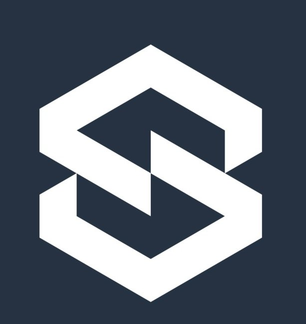
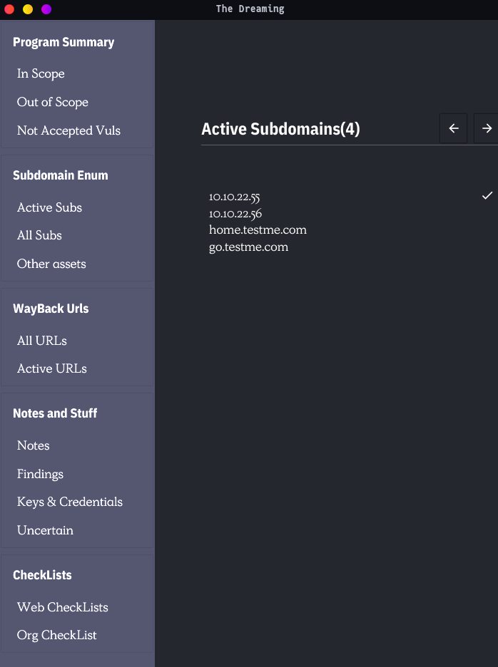
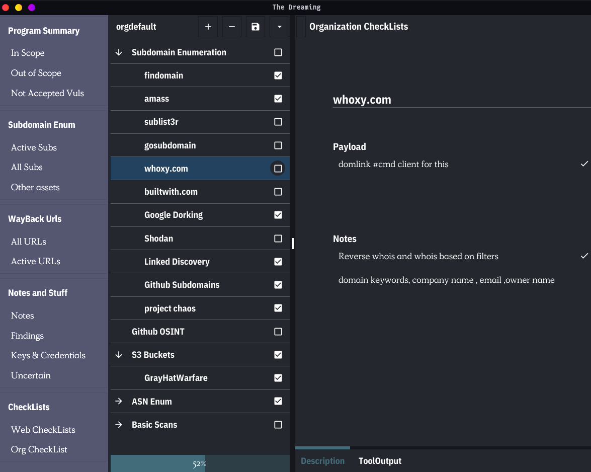
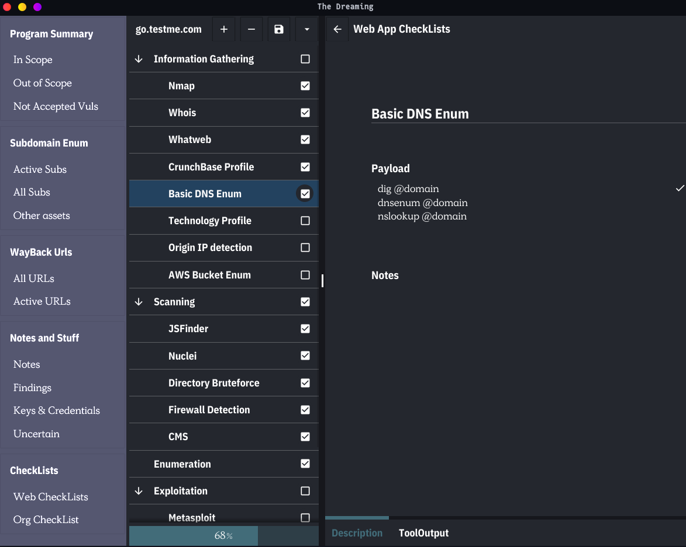

<h1 align="center">
  </a>
  <br>
</h1>

<p align="center">
<a href="https://opensource.org/licenses/BSD-3-Clause"></a>
<a href="https://goreportcard.com/badge/github.com/tarunKoyalwar/sandman"></a>
<a href="https://github.com/tarunKoyalwar/sandman/releases"></a>
<a href="https://twitter.com/KoyalwarTarun"></a>

<p align="center">
  <a href="#screenshots">Screenshots</a>
  <a href="#features">Features</a> •
  <a href="#installation-instructions">Installation</a> •
  <a href="#usage">Usage</a> •
  <a href="#upcoming">Features</a> •
  <a href="#-notes">Notes</a> •
</p>

# Sandman
A Target Tracking , NoteTaking , CheckLists and Data Management GUI App for Bug Hunter's and Pentesters. It is designed to Track Progress , Store and Retrieve tools data , CheckLists per domain and much more (future releases). It is designed while keeping in mind the ease and requirements while working on a program.It also has an integrated web server which can be used to get and post data to its respective pages.

This Cross Platform Native App is Powered By
  - [Fyne](https://github.com/fyne-io/fyne)
  - MongoDB 
  - gorilla/mux

To Know More About the Functionalities , Usage and Structure Do refer the project [wiki](https://github.com/tarunKoyalwar/Sandman/wiki).

This App Also has an awesome cmd client app [Matthew](https://github.com/tarunKoyalwar/matthew) to store and retrieve data to UI App. It can be 
seamlessly integrated with your bash scripts / tools . It is similar to Linux Command `tee`

```sh
asserfinder abc.com | matthew web -s abc.com -t assetfinder --post
```

This will continuously post tool output to its appropriate destination in checklist in chunks .We can also get data from UI App (Ex : all-urls ,all-subs etc). To know more visit Matthew


# Screenshots

<h1 align="center">
  </a>
  <br>
</h1>

<h1 align="center">
  </a>
  <br>
</h1>

<h1 align="center">
  </a>
  <br>
</h1>

For More Refer to screenshots/

# Features

  - CheckList For Each Domain With Progress Tracking.
  - Integrated HTTP Server to Store and Retrieve Data.
  - Consists of Multiple Pages (In Scope, All Subs , Active Urls etc).
  - Cred Page For Storing Credentials.
  - Store and Retrieve Tool Output of Each CheckList Item for each domain and project.
  - Personal Notes / Findings for each Project.
  - Pagination For Storing Large Content.

Refer [Upcoming](#upcoming) for Planned and Upcoming Content.

# Installation Instructions

Download Binaries From Releases 

 ## Build From Source 

 - Install Go
 - Make Sure $GOPATH/bin is added to PATH env Variable
 
 ```sh
 go install github.com/tarunKoyalwar/sandman@latest
 ```
 
You Can Either Install MongoDB Locally or Use [MongoDB Atlas Free Instance](https://www.mongodb.com/cloud/atlas/register)

Windows and Mac Users. If you face any problems while building visit [fyne](https://github.com/fyne-io/fyne) .


# Usage

Open App Using Terminal To View App Logs

 ```sh
 sandman
 ```

When Installed From Releases . Open App Using Application Menu.

When MongoDB is Installed Locally . 
Verify that Instace is running.

###  Refer [wiki](https://github.com/tarunKoyalwar/Sandman/wiki) regarding Usage of CheckLists

# Upcoming

This is First Release Lot of Planned Content Has Not been Implemented Yet. The Most Important of them Include Following.


 - [ ] Editable MarkDown Support
 - [ ] Automation 
   -  [ ] Script Engine
      -   [ ] Checkpoints
      -   [ ] Multiprocessing
      -   [ ] Scheduling
      -   [ ] Regex , Pre and Post Processing
      -   [ ] Resource Control
   -  [ ] [Notify](https://github.com/projectdiscovery/notify) Support
 - [ ] Browser Extensions
 - [ ] Android App ( UI redesing Left )
 - [ ] IOS App
 - [ ] Docker + Fyne Terminal


## UI Development

This Project Only Intends to Use Fyne For UI. Since Fyne Is Not A Full Framework Yet . Multimedia Support , Drag and Drop  and Other Advanced UI Features Cannot be Implemented Yet.

New UI Features Wil Follow within a Month or Two of Fyne Release.

As For the Theme and Styling Fyne is Currently Focusing on Core Components. To Style any components we have to create Custom Widgets Which Takes Lot of Time .So I don't Intend to Change Any Styling unless it is essential .


If Anyone is Familiar With Fyne and want to contribute DM me on twitter or Create a issue.


# Acknowledgement

Logo Obtained From 
<a href="https://www.vecteezy.com/free-vector/letter-s-logo">Letter S Logo Vectors by Vecteezy</a>

Thanks Fyne Team For Awesome Framework.
